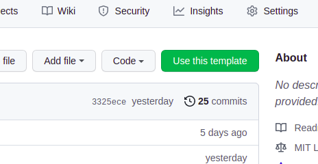
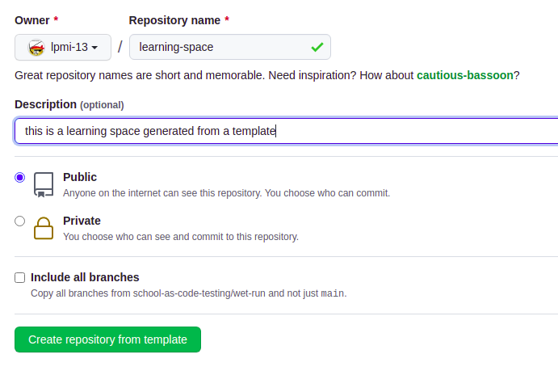
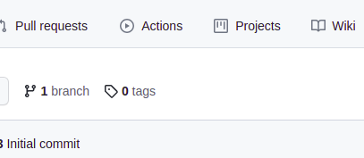
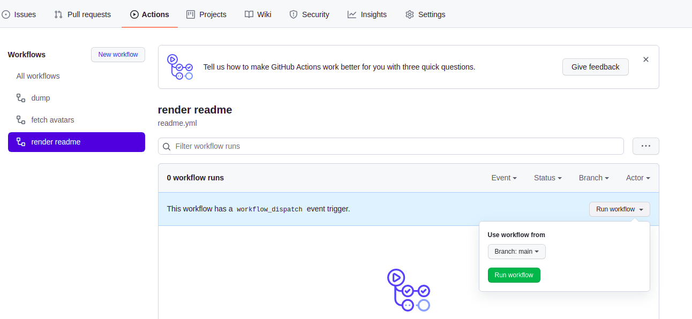
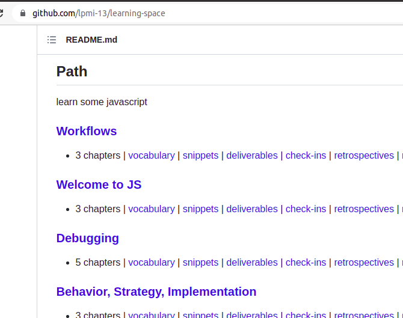

<!-- BEGIN TOP -->

# Setup Instructions

This is the seed template for your very own learning space. All you need to do
is use this template to generate your own repository, and the github action will
do all the work of setting up the readme with steps for your learning journey!

## Getting Started

1. Click the "Use Template" button on the upper right hand corner of this page.
   
2. You can name the repository whatever you want
   
3. After your new repository is done being created, you'll be redirected to it.
4. To generate your learning path, go to the "Actions" tab and click on "I
   understand my workflows, go ahead and enable them".
   
5. In the Workflows section, select "set up repo", and press the "run workflow"
   button to run the action
   
6. The GitHub action will run and set up your readme, so you can read it to find
   out what to study first!
   

---

<!-- END TOP -->

<!-- BEGIN MODULES -->

<!-- END MODULES -->

<!-- BEGIN LEARNERS -->

<!-- END LEARNERS -->

## Code Checks

1. `git clone git@github.com:school-as-code/school-as-code.git`
2. `cd school-as-code`
3. `npm install`

Once everything is installed you will have these scripts:

- `npm run format`: Formats the code with Prettier
- `npm run lint:ls`: Lints file & folder naming conventions with `ls-lint`
- `npm run lint:md`: Lints all Markdown with `markdownlint`
- `npm run spell-check`: Checks the spelling in all files using `cspell`. You
  can add new correct words to the [./.cspell.json](./.cspell.json) file so they
  won't cause an error.

## Continuous Integration

Both linting checks are run when a PR is opened to `main`.
